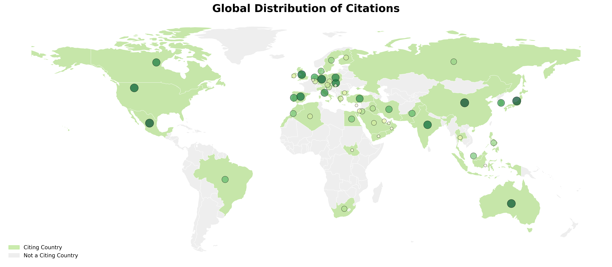
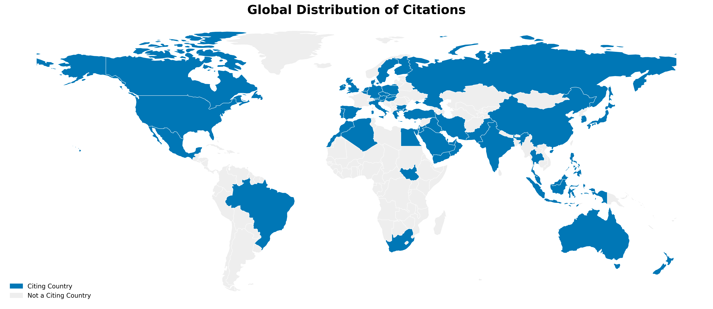
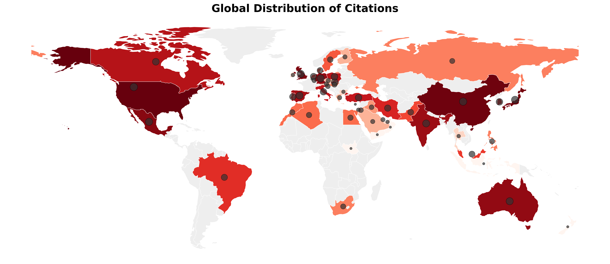
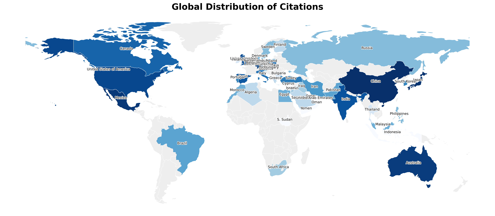
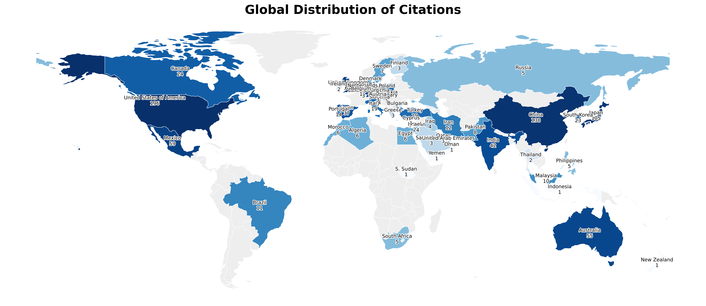

# Citation Map

A Python toolkit to fetch and visualize the global distribution of your academic citations.

This repository contains two primary modules:

1.  **`citation_fetcher.py`**: A unified tool to fetch all citations for an author. It supports multiple input methods (**[OpenAlex ID](https://help.openalex.org/hc/en-us/articles/27281068027031-How-do-I-find-my-OpenAlex-author-ID)**, **[ORCID](https://orcid.org/signin)**, **[Google Scholar ID](https://scholar.google.com)**, or **local CSV**) and **always generates an intermediate publication list** for your review.
2.  **`create_citation_map.py`**: A module to generate highly customizable world maps from the fetched citation data.



## Installation

1.  Clone this repository:
    ```bash
    git clone https://github.com/linjunhe/citation-map.git
    cd citation-map
    ```

2.  Install the required Python packages:
    ```bash
    pip install -r requirements.txt
    ```

## How to Use

The workflow is two steps: fetching data, then creating the map.

### Step 1: Fetch Your Citation Data

You can run `citation_fetcher.py` from the command line. It is highly recommended to provide your email address for polite API access.

#### Method A: Using ORCID (Recommended)
* **Logic**: Fetches your publication list from the ORCID API.
* **DOI Handling**: Uses the DOI provided by ORCID if available. If a DOI is missing, it attempts to find it via [Crossref](https://www.crossref.org/) based on the publication title.
* **Intermediate Output**: Saves `publications_with_doi_orcid.csv`.
```bash
python citation_fetcher.py --orcid 0000-0002-XXXX-XXXX --email your_email@example.com
````

#### Method B: Using Google Scholar ID

  * **Logic**: Scrapes your publication list from Google Scholar using the [scholarly](https://pypi.org/project/scholarly/) library.
  * **DOI Handling**: Since Google Scholar does not provide DOIs, **all** DOIs are retrieved via [Crossref](https://www.crossref.org/) based on the publication titles.
  * **Intermediate Output**: Saves `publications_with_doi_scholar.csv`.

```bash
python citation_fetcher.py --scholar_id SCHOLAR_ID --email your_email@example.com
```


#### Method C: Using OpenAlex Author ID (Recommended)
  * **Logic**: Directly fetches your work list from [OpenAlex](https://openalex.org/). This is the fastest method if you already have your [OpenAlex author ID](https://help.openalex.org/hc/en-us/articles/27281068027031-How-do-I-find-my-OpenAlex-author-ID).
  * **Intermediate Output**: Saves `publications_with_doi_openalex.csv` for your reference.

```bash
python citation_fetcher.py --openalex_id A5XXXXXXXX --email your_email@example.com
```
#### Method D: Using a Local CSV
If you have a CSV file (e.g., `my_publications_with_doi.csv`) with a column named `DOI` or `doi`, you can use it directly.

```bash
python citation_fetcher.py --csv my_publications_with_doi.csv --email your_email@example.com
```


All options generate a `citation_info.csv` file (output filename can be changed via `--output`).

| my\_publication | cited\_by\_title | cited\_by\_author | cited\_by\_institution | cited\_by\_country |
| :--- | :--- | :--- | :--- | :--- |
| My Paper Title A | Citing Paper Title X | Author Name 1 | University of A | US |
| My Paper Title A | Citing Paper Title X | Author Name 2 | University of B | CN |
| My Paper Title A | Citing Paper Title Y | Author Name 3 | University of C | DE |
| My Paper Title B | Citing Paper Title Z | Author Name 4 | University of D | GB |

*(Note: Rows are duplicated for each author and institution associated with a single citing paper.)*

**Important:** The `create_citation_map.py` script **only uses the `cited_by_country` column** to generate the map. The other columns (`my_publication`, `cited_by_institution`, etc.) are provided for your own analysis.

### Step 2: Create Your Citation Map

Import and call the `create_citation_map` function in a Python script (e.g., `run_demo.py`). Point it to the `citation_info.csv` file generated in Step 1.

This example creates a simple green map with 70% alpha and adds pins that scale in **color** and **size** based on the `log_rank` scale.

```python
from create_citation_map import create_citation_map

# -- Run the map generator --
create_citation_map(
    "citation_info.csv",
    output_filename='map_ex_simple_green_with_pin.png',
    scale='log_rank', # Use rank scale for pins
    fill_mode='simple',
    fill_alpha=0.7,
    fill_color='#B5E48C', # Light green fill
    show_pins=True,
    pin_cmap='YlGn',     # Use a green heatmap for pins
    pin_scale_color=True,  # Scale pin color
    pin_scale_size=True,   # Scale pin size
    pin_scale_alpha=False,  # Use static alpha for pins
    pin_size_range=(30, 250),
    show_legend=True,
)
```

## Examples & Inspiration

Here are a few other examples to get you started. Please experiment with the settings and share your creations\!


**Example 1: Simple Mode (Blue)**

A simple map showing cited vs. non-cited countries with a solid blue fill and a legend.

```python
create_citation_map(
    "citation_info.csv",
    output_filename='map_ex1_simple_blue.png',
    fill_mode='simple',
    fill_color='#0077B6', # Use a blue fill
    show_legend=True,
)
```



-----


**Example 2: Heatmap Mode (Red) with Pins**

A `log_rank` scaled heatmap using a red colormap, adding dark grey pins with a static size but scaled alpha.

```python
create_citation_map(
    "citation_info.csv",
    output_filename='map_ex2_heatmap_with_Reds_cmap_with_pin.png',
    scale='log_rank',
    fill_mode='heatmap',
    fill_cmap='Reds',
    show_pins=True,
    pin_color='#333333',   # Dark grey pins
    pin_scale_alpha=False,   # Use static alpha
    show_legend=True,
)
```



-----


**Example 3: Heatmap Mode (Blue) with Labels**

A `log_rank` scaled heatmap using a blue colormap, with country labels.

```python
create_citation_map(
    "citation_info.csv",
    output_filename='map_ex3_heatmap_with_label.png',
    scale='log_rank',
    fill_mode='heatmap',
    fill_cmap='Blues',
    show_labels=True,
    show_legend=True,
)
```



-----


**Example 4: Heatmap Mode (Blue) with Labels & Counts**

A `log_rank` scaled heatmap using a blue colormap, with country labels and counts.

```python
create_citation_map(
    "citation_info.csv",
    output_filename='map_ex4_heatmap_with_label_count.png',
    scale='log_rank',
    fill_mode='heatmap',
    fill_cmap='Blues',
    show_labels=True,
    show_legend=True,
    show_counts=True,
)
```




## Map Function Reference (`create_citation_map`)

Here are all the available parameters for `create_citation_map`:

| Parameter | Type | Default | Description |
| :--- | :--- | :--- | :--- |
| `csv_filepath` | `str` | **Required** | Path to the input CSV file. |
| `output_filename` | `str` | `'citation_map.png'` | Output filename (e.g., .png, .jpg, .pdf). |
| | | | |
| **Data Scaling** | | | |
| `scale` | `str` | `'linear'` | Scaling method for counts: `'linear'`, `'log'`, `'rank'`, or `'log_rank'`. This is the master scale used for all scaled operations. |
| | | | |
| **Country Fill Style** | | | |
| `fill_mode` | `str` | `'heatmap'` | How to fill cited countries: `'simple'`, `'heatmap'`, or `'alpha'`. |
| `fill_color` | `str` | `'#E63946'` | Base color for `'simple'` and `'alpha'` modes, and for the legend. |
| `fill_alpha` | `float` | `1.0` | Alpha for `'simple'` mode (0.0 to 1.0). |
| `fill_cmap` | `str` | `'YlOrRd'` | Matplotlib colormap for `'heatmap'` mode. |
| | | | |
| **Pin Style** | | | |
| `show_pins` | `bool` | `False` | If True, add markers to cited countries. |
| `pin_color` | `str` | `'#E63946'` | Base color for pins (if `pin_scale_color=False`). |
| `pin_cmap` | `str` | `'viridis'` | Colormap for pins (if `pin_scale_color=True`). |
| `pin_scale_color` | `bool` | `False` | If True, pin color varies based on scaled value. |
| `pin_scale_size` | `bool` | `True` | If True, pin size varies based on scaled value. |
| `pin_scale_alpha` | `bool` | `True` | If True, pin alpha varies based on scaled value. |
| `pin_size_range` | `tuple` | `(20, 200)` | `(min, max)` tuple for scaled pin size. |
| `pin_size_static` | `int` | `50` | Size for static pins (if `pin_scale_size=False`). |
| | | | |
| **Other Options** | | | |
| `show_labels` | `bool` | `False` | If True, add country name labels. |
| `show_counts` | `bool` | `False` | If True, add citation counts. |
| `adjust_labels` | `bool` | `False` | If True, adjust labels to avoid overlapping. |
| `label_top_n` | `int` | `None` | Only shows labels for the top N most-cited countries. |
| `show_legend` | `bool` | `False` | If True, show a simple 'Citing' vs 'Not Citing' legend. |
| `base_color` | `str` | `'#EEEEEE'` | Color for non-citing countries. |
| `border_color` | `str` | `'#FFFFFF'` | Color for country borders. |
